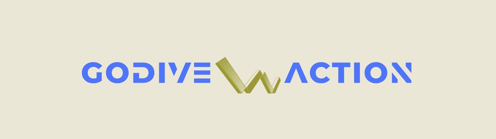
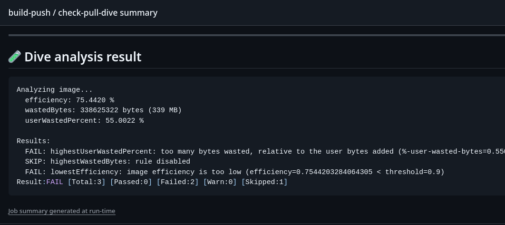
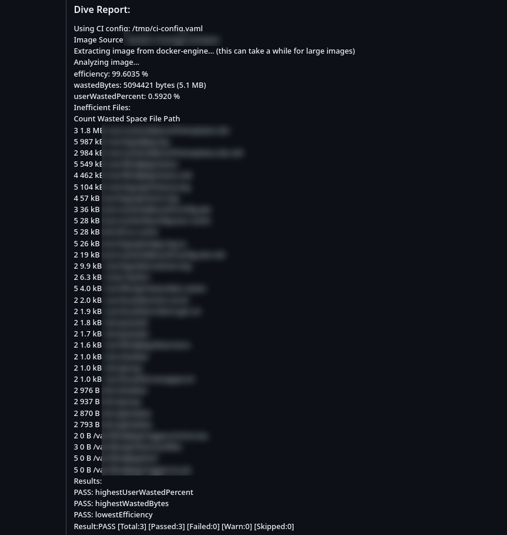

---

---


---
#  GODive ACTION – GitHub Action for Docker Image Analysis

**Dive CI Analysis** is a GitHub Action that leverages the powerful [`dive`](https://github.com/wagoodman/dive) tool to analyze Docker images directly in your CI/CD pipeline. It provides detailed insights into image structure, efficiency, wasted space, and can enforce automated quality gates to ensure your images remain lean and production-ready.

>  Ideal for teams optimizing Docker images, hardening security, or maintaining CI health.

---

## 📌 Why Use This Action?

-  Enforces image **efficiency** and **layer quality** via thresholds
-  Generates **reports and summaries** to review in CI interface
-  Flexible config via `.dive-ci.yml` or **on-the-fly input params**
-  Automatically installs and runs the latest version of `dive`
-  Supports **CI fail-fast behavior** for bad images
-  Works out-of-the-box with any docker images

---

## 🚀 Quick Start

```yaml
name: Dive CI Image Analysis

on: [push]

jobs:
  analyze:
    runs-on: ubuntu-latest
    steps:
      - uses: actions/checkout@v4

      - name: Dive analyze
        uses: dzhunli/godive-action@v2.0.8
        with:
          image_name: my-image:latest
          lowestEfficiency: "0.85"
          highestWastedBytes: "15MB"
          highestUserWastedPercent: "0.2"
          summary: true
```
---
## Information about possible flags and variables

 Input Name                 | Description                                                                | Required | Default 
 -------------------------- | -------------------------------------------------------------------------- | -------- | ------- 
 `image_name`               | **Docker image name** (e.g. `backend:latest`, `nginx:1.25.1`)              | ✅ Yes    | —       
 `use_config`               | Use external `.dive-ci.yml` (`true`) or define thresholds inline (`false`) | ❌ No     | `false` 
 `ci_config`                | Path to `.dive-ci.yml` if `use_config` is `true`                           | ❌ No     | —       
 `lowestEfficiency`         | Minimum acceptable efficiency (0.0–1.0)                                    | ❌ No  *  | —       
 `highestWastedBytes`       | Maximum wasted space allowed (e.g. `10MB`, `500KB`)                        | ❌ No  *  | —       
 `highestUserWastedPercent` | Max % of user layer waste (0.0–1.0)                                        | ❌ No  *  | —       
 `allow_large_image`        | Set to `true` if the image is >1GB to bypass scanning                      | ❌ No     | `false` 
 `continue_on_fail`         | Continue the step with (zero exit code) even if thresholds fail            | ❌ No     | `true`  
 `report`                   | Generate `/tmp/DIVE_REPORT.md` markdown report                             | ❌ No     | `true`  
 `summary`                  | Append summary to the GitHub Actions UI summary tab                        | ❌ No     | `false` 

*  \* **Required only if use_config: false**

#### Example of a .dive-ci.yml file
```yaml
rules:
  # If the efficiency is measured below X%, mark as failed.
  # Expressed as a ratio between 0-1.
  lowestEfficiency: 0.95

  # If the amount of wasted space is at least X or larger than X, mark as failed.
  # Expressed in B, KB, MB, and GB.
  highestWastedBytes: 20MB

  # If the amount of wasted space makes up for X% or more of the image, mark as failed.
  # Note: the base image layer is NOT included in the total image size.
  # Expressed as a ratio between 0-1; fails if the threshold is met or crossed.
  highestUserWastedPercent: 0.20
```
---
### *Example of how action summary look like now*

<p align="left">
  
</p>

### *Example of how action report look like now (added to release)*

<p align="left">
  
</p>

---
## 🤝 Contributing & Collaboration

I'm open to collaboration and community contributions! Whether you're interested in improving this GitHub Action, suggesting optimizations, or just exploring best practices for Docker image analysis, feel free to reach out or submit a pull request.

### How to Contribute

- **Open an Issue**: Found a bug, have a feature request, or want to suggest a change? Please open an issue with a clear title and detailed description.
- **Create a Pull Request**: Fork the repository, create a new branch, and open a pull request with your changes. Please follow clear commit messages and explain the reason for the changes.
- **Follow Best Practices**: Try to align with the [GitHub Actions best practices](https://docs.github.com/en/actions/learn-github-actions/best-practices-for-github-actions) and keep your contributions modular and testable.
- **Be Respectful**: Let's maintain a welcoming environment for everyone.

Your ideas, suggestions, and code are very welcome!

## 🙏 Credits

- Based on the awesome tool dive by @wagoodman

- Maintained by @dzhunli